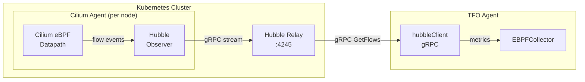
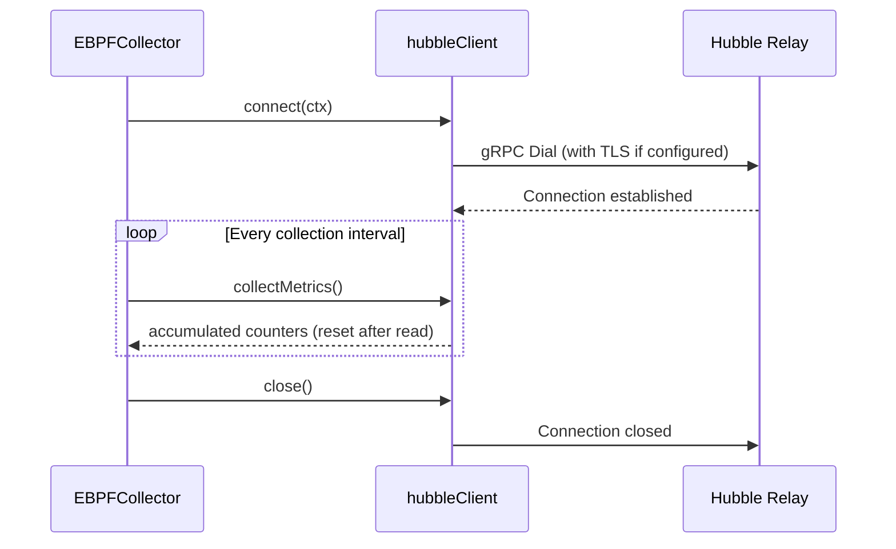

# eBPF Collector - Cilium Hubble Integration

## Overview

The Hubble integration provides Cilium-native network observability by
connecting to Hubble Relay via gRPC. This complements kernel-level eBPF
metrics with CNI-level L3/L4/L7 visibility including HTTP, gRPC, DNS,
and Kafka protocol parsing.



## Configuration

```yaml
collectors:
  ebpf:
    enabled: true
    cilium:
      enabled: true
      hubble_address: "localhost:4245"

      # TLS (optional, for production)
      hubble_tls_enabled: false
      hubble_tls_cert: "/etc/tfo-agent/hubble-client.crt"
      hubble_tls_key: "/etc/tfo-agent/hubble-client.key"
      hubble_tls_ca: "/etc/tfo-agent/hubble-ca.crt"

      # Collection toggles
      collect_flows: true # L3/L4 flows
      collect_l7_flows: false # L7 protocol parsing
      collect_drops: true # Dropped packets
      collect_policies: true # Policy verdicts
```

## Hubble Metrics

| Metric                   | Type    | Description                                     |
| ------------------------ | ------- | ----------------------------------------------- |
| `hubble.flows`           | counter | Total network flows observed                    |
| `hubble.drops`           | counter | Packets dropped by Cilium policy                |
| `hubble.policy_verdicts` | counter | Network policy evaluations                      |
| `hubble.http_requests`   | counter | HTTP requests (L7, requires `collect_l7_flows`) |
| `hubble.dns_queries`     | counter | DNS queries (L7, requires `collect_l7_flows`)   |
| `hubble.l7_errors`       | counter | L7 protocol errors                              |

## Connection Lifecycle



## Architecture Details

### hubbleClient

The `hubbleClient` manages:

- **gRPC connection** to Hubble Relay with optional TLS
- **Counter accumulation** between collection intervals (thread-safe via `sync.RWMutex`)
- **Metric collection**: Returns current counters and resets them atomically

### TLS Configuration

For production Cilium clusters, Hubble Relay typically requires mutual TLS.
The client supports:

- Client certificate + key (for mutual TLS)
- CA certificate (for server verification)
- Minimum TLS 1.2

### Connection Resilience

- 10-second dial timeout for initial connection
- Connection failures are logged as warnings (non-fatal)
- If Hubble is unavailable, the rest of the eBPF collector continues normally
- `isConnected()` check prevents metric collection attempts on dead connections

## Prerequisites

1. **Cilium** installed as the CNI in your Kubernetes cluster
2. **Hubble** enabled in Cilium configuration:
   ```bash
   cilium hubble enable
   ```
3. **Hubble Relay** deployed and reachable from the agent:
   ```bash
   cilium hubble port-forward &
   ```

## Kubernetes Deployment

When running TFO Agent as a DaemonSet with Hubble:

```yaml
# In DaemonSet spec
containers:
  - name: tfo-agent
    env:
      - name: TELEMETRYFLOW_EBPF_ENABLED
        value: "true"
    volumeMounts:
      - name: hubble-tls
        mountPath: /etc/tfo-agent/hubble-tls
        readOnly: true
volumes:
  - name: hubble-tls
    secret:
      secretName: hubble-relay-client-certs
```

## Example Queries

```promql
# Total network flow rate
rate(tfo_hubble_flows[5m])

# Drop rate (indicates policy blocks or errors)
rate(tfo_hubble_drops[5m])

# HTTP request rate through Cilium
rate(tfo_hubble_http_requests[5m])

# DNS query rate
rate(tfo_hubble_dns_queries[5m])

# Policy verdict rate
rate(tfo_hubble_policy_verdicts[5m])
```
