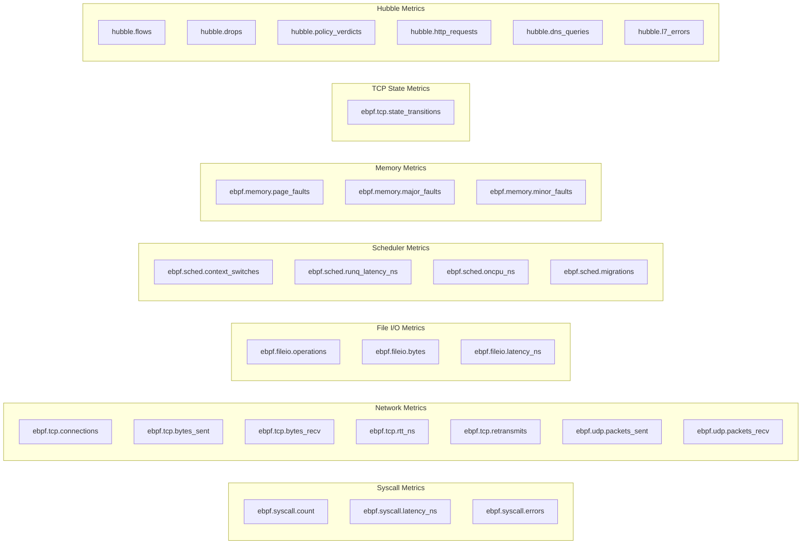

# eBPF Collector - Metric Catalog

All eBPF metrics use the `ebpf.` prefix internally, which maps to `tfo_ebpf_*`
in Prometheus format. Hubble metrics use the `hubble.` prefix (`tfo_hubble_*`).

## Metric Overview



## Syscall Metrics

Collected from `tracepoint/raw_syscalls/sys_enter` and `sys_exit`.

| Metric                    | Type    | Labels                   | Description                            |
| ------------------------- | ------- | ------------------------ | -------------------------------------- |
| `ebpf.syscall.count`      | counter | `pid`, `comm`, `syscall` | Total syscall invocations              |
| `ebpf.syscall.latency_ns` | counter | `pid`, `comm`, `syscall` | Cumulative syscall latency (ns)        |
| `ebpf.syscall.errors`     | counter | `pid`, `comm`, `syscall` | Failed syscall count (negative return) |

**Prometheus names**: `tfo_ebpf_syscall_count`, `tfo_ebpf_syscall_latency_ns`, `tfo_ebpf_syscall_errors`

**Syscall label values**: `read`, `write`, `open`, `close`, `stat`, `mmap`, `socket`, `connect`, `accept`, `bind`, `listen`, `fork`, `execve`, `openat`, `clone3`, and 50+ more.

### Example PromQL

```promql
# Top 10 syscalls by rate
topk(10, rate(tfo_ebpf_syscall_count[5m]))

# Average syscall latency
rate(tfo_ebpf_syscall_latency_ns[5m]) / rate(tfo_ebpf_syscall_count[5m])

# Error rate by syscall
rate(tfo_ebpf_syscall_errors[5m]) / rate(tfo_ebpf_syscall_count[5m])
```

## Network Metrics

Collected from kprobes on `tcp_connect`, `tcp_sendmsg`, `tcp_recvmsg`,
`tcp_retransmit_skb`, `udp_sendmsg`, `udp_recvmsg`.

### TCP Metrics

| Metric                 | Type    | Labels        | Description                     |
| ---------------------- | ------- | ------------- | ------------------------------- |
| `ebpf.tcp.connections` | counter | `pid`, `comm` | New TCP connections             |
| `ebpf.tcp.bytes_sent`  | counter | `pid`, `comm` | TCP bytes sent                  |
| `ebpf.tcp.bytes_recv`  | counter | `pid`, `comm` | TCP bytes received              |
| `ebpf.tcp.rtt_ns`      | gauge   | `pid`, `comm` | Latest TCP round-trip time (ns) |
| `ebpf.tcp.retransmits` | counter | `pid`, `comm` | TCP retransmission count        |

### UDP Metrics

| Metric                  | Type    | Labels        | Description          |
| ----------------------- | ------- | ------------- | -------------------- |
| `ebpf.udp.packets_sent` | counter | `pid`, `comm` | UDP packets sent     |
| `ebpf.udp.packets_recv` | counter | `pid`, `comm` | UDP packets received |

### Example PromQL

```promql
# TCP throughput by process
rate(tfo_ebpf_tcp_bytes_sent{comm="nginx"}[5m])

# Connection rate
rate(tfo_ebpf_tcp_connections[5m])

# Retransmission ratio
rate(tfo_ebpf_tcp_retransmits[5m]) / rate(tfo_ebpf_tcp_connections[5m])
```

## File I/O Metrics

Collected from kprobes on `vfs_read`, `vfs_write`, `vfs_open`.

| Metric                   | Type    | Labels                     | Description                |
| ------------------------ | ------- | -------------------------- | -------------------------- |
| `ebpf.fileio.operations` | counter | `pid`, `comm`, `operation` | VFS operation count        |
| `ebpf.fileio.bytes`      | counter | `pid`, `comm`, `operation` | VFS bytes transferred      |
| `ebpf.fileio.latency_ns` | counter | `pid`, `comm`, `operation` | VFS operation latency (ns) |

**Operation label values**: `read`, `write`, `open`

### Example PromQL

```promql
# I/O throughput by operation
rate(tfo_ebpf_fileio_bytes{operation="write"}[5m])

# Average I/O latency
rate(tfo_ebpf_fileio_latency_ns[5m]) / rate(tfo_ebpf_fileio_operations[5m])
```

## Scheduler Metrics

Collected from `tracepoint/sched/sched_switch`.

| Metric                        | Type    | Labels        | Description                 |
| ----------------------------- | ------- | ------------- | --------------------------- |
| `ebpf.sched.context_switches` | counter | `pid`, `comm` | Context switch count        |
| `ebpf.sched.runq_latency_ns`  | gauge   | `pid`, `comm` | Run queue latency (ns)      |
| `ebpf.sched.oncpu_ns`         | counter | `pid`, `comm` | Cumulative on-CPU time (ns) |
| `ebpf.sched.migrations`       | counter | `pid`, `comm` | CPU migration count         |

### Example PromQL

```promql
# Context switches per second
rate(tfo_ebpf_sched_context_switches[5m])

# Run queue latency (scheduling delay)
tfo_ebpf_sched_runq_latency_ns

# CPU time consumed by process
rate(tfo_ebpf_sched_oncpu_ns[5m]) / 1e9
```

## Memory Metrics

Collected from `tracepoint/exceptions/page_fault_user` and `page_fault_kernel`.

| Metric                     | Type    | Labels        | Description                      |
| -------------------------- | ------- | ------------- | -------------------------------- |
| `ebpf.memory.page_faults`  | counter | `pid`, `comm` | Total page faults                |
| `ebpf.memory.major_faults` | counter | `pid`, `comm` | Major faults (disk I/O required) |
| `ebpf.memory.minor_faults` | counter | `pid`, `comm` | Minor faults (in-memory)         |

### Example PromQL

```promql
# Major fault rate (indicates memory pressure)
rate(tfo_ebpf_memory_major_faults[5m])

# Ratio of major to total faults
rate(tfo_ebpf_memory_major_faults[5m]) / rate(tfo_ebpf_memory_page_faults[5m])
```

## TCP State Metrics

Collected from `tracepoint/sock/inet_sock_set_state`.

| Metric                       | Type    | Labels                          | Description            |
| ---------------------------- | ------- | ------------------------------- | ---------------------- |
| `ebpf.tcp.state_transitions` | counter | `pid`, `old_state`, `new_state` | TCP state change count |

**State label values**: `ESTABLISHED`, `SYN_SENT`, `SYN_RECV`, `FIN_WAIT1`,
`FIN_WAIT2`, `TIME_WAIT`, `CLOSE`, `CLOSE_WAIT`, `LAST_ACK`, `LISTEN`,
`CLOSING`, `NEW_SYN_RECV`

### Example PromQL

```promql
# New connections established
rate(tfo_ebpf_tcp_state_transitions{new_state="ESTABLISHED"}[5m])

# Connection closures
rate(tfo_ebpf_tcp_state_transitions{new_state="CLOSE"}[5m])

# TIME_WAIT accumulation (potential socket exhaustion)
rate(tfo_ebpf_tcp_state_transitions{new_state="TIME_WAIT"}[5m])
```

## Hubble Metrics

Collected via gRPC from Cilium Hubble Relay.

| Metric                   | Type    | Labels   | Description                  |
| ------------------------ | ------- | -------- | ---------------------------- |
| `hubble.flows`           | counter | `source` | Total network flows observed |
| `hubble.drops`           | counter | `source` | Dropped packet count         |
| `hubble.policy_verdicts` | counter | `source` | Network policy verdict count |
| `hubble.http_requests`   | counter | `source` | HTTP request count (L7)      |
| `hubble.dns_queries`     | counter | `source` | DNS query count (L7)         |
| `hubble.l7_errors`       | counter | `source` | L7 protocol error count      |

### Example PromQL

```promql
# Flow rate
rate(tfo_hubble_flows[5m])

# Drop rate (potential network issues)
rate(tfo_hubble_drops[5m])

# HTTP request rate
rate(tfo_hubble_http_requests[5m])
```

## Label Reference

| Label       | Metrics   | Description                             |
| ----------- | --------- | --------------------------------------- |
| `pid`       | All eBPF  | Linux process ID                        |
| `comm`      | Most eBPF | Process command name (16 chars max)     |
| `syscall`   | Syscall   | Syscall name (e.g., `read`, `write`)    |
| `operation` | FileIO    | VFS operation (`read`, `write`, `open`) |
| `old_state` | TCP State | Previous TCP state                      |
| `new_state` | TCP State | New TCP state                           |
| `source`    | Hubble    | Always `hubble`                         |
