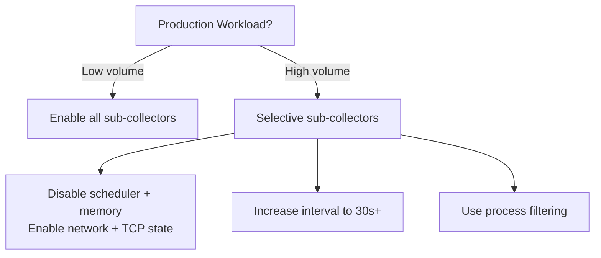

# eBPF Collector - Operations Guide

## System Requirements

### Kernel

| Requirement   | Minimum | Recommended |
| ------------- | ------- | ----------- |
| Linux kernel  | 4.15    | 5.2+        |
| BTF support   | 5.2+    | 5.8+        |
| CO-RE support | 5.2+    | 5.8+        |

### Capabilities

The agent needs specific Linux capabilities to load BPF programs:

```bash
# Option 1: Recommended (least privilege)
setcap cap_bpf,cap_perfmon+ep /usr/local/bin/tfo-agent

# Option 2: Legacy (broader permissions)
setcap cap_sys_admin+ep /usr/local/bin/tfo-agent

# Option 3: Run as root (development only)
sudo ./build/tfo-agent start
```

### Filesystem

- `/sys/fs/bpf` must be mounted (for map pinning)
- `/sys/kernel/btf/vmlinux` should exist (for CO-RE)

```bash
# Verify BPF filesystem
mount | grep bpf
# Expected: bpf on /sys/fs/bpf type bpf (rw,nosuid,nodev,noexec,relatime)

# Verify BTF
ls -la /sys/kernel/btf/vmlinux
```

## Deployment

### Standalone Binary

```bash
# Build
make build

# Set capabilities
sudo setcap cap_bpf,cap_perfmon+ep ./build/tfo-agent

# Run
./build/tfo-agent start --config configs/tfo-agent.yaml
```

### Docker

```dockerfile
FROM ubuntu:22.04

# eBPF requires --privileged or specific capabilities
COPY build/tfo-agent-linux-amd64 /usr/local/bin/tfo-agent
COPY configs/tfo-agent.yaml /etc/tfo-agent/config.yaml

CMD ["tfo-agent", "start", "--config", "/etc/tfo-agent/config.yaml"]
```

```bash
docker run --privileged \
  -v /sys/fs/bpf:/sys/fs/bpf \
  -v /sys/kernel/btf:/sys/kernel/btf:ro \
  telemetryflow/tfo-agent:latest
```

### Kubernetes DaemonSet

```yaml
apiVersion: apps/v1
kind: DaemonSet
metadata:
  name: tfo-agent
  namespace: telemetryflow
spec:
  selector:
    matchLabels:
      app: tfo-agent
  template:
    metadata:
      labels:
        app: tfo-agent
    spec:
      hostPID: true
      hostNetwork: true
      containers:
        - name: tfo-agent
          image: telemetryflow/tfo-agent:latest
          securityContext:
            privileged: true
          volumeMounts:
            - name: bpf
              mountPath: /sys/fs/bpf
            - name: btf
              mountPath: /sys/kernel/btf
              readOnly: true
            - name: config
              mountPath: /etc/tfo-agent
      volumes:
        - name: bpf
          hostPath:
            path: /sys/fs/bpf
        - name: btf
          hostPath:
            path: /sys/kernel/btf
        - name: config
          configMap:
            name: tfo-agent-config
```

## Troubleshooting

### Common Issues

#### "BPF filesystem not mounted"

```bash
sudo mount -t bpf bpf /sys/fs/bpf
```

Or add to `/etc/fstab`:

```
bpf /sys/fs/bpf bpf rw,nosuid,nodev,noexec,relatime 0 0
```

#### "Operation not permitted" loading BPF programs

Missing capabilities. Ensure:

```bash
# Check capabilities
getcap /usr/local/bin/tfo-agent

# Set required capabilities
sudo setcap cap_bpf,cap_perfmon+ep /usr/local/bin/tfo-agent
```

#### "BTF not available" / CO-RE relocation errors

Kernel may not have BTF enabled. Check:

```bash
ls /sys/kernel/btf/vmlinux
```

If missing, provide a pre-generated BTF file:

```yaml
collectors:
  ebpf:
    btf_path: /path/to/vmlinux.btf
```

Generate from kernel source:

```bash
pahole --btf_encode_detached vmlinux.btf vmlinux
```

#### Sub-collector reports "Failed to load"

Individual BPF programs may fail if the kernel lacks specific tracepoints.
This is non-fatal — other sub-collectors continue working:

```
WARN  Failed to load scheduler programs, disabling
```

Check available tracepoints:

```bash
cat /sys/kernel/debug/tracing/available_events | grep sched_switch
```

#### No metrics on non-Linux

Expected behavior. The collector returns empty metrics on macOS/Windows.
Check logs for:

```
INFO  eBPF collector: not running on Linux, metrics will be empty
```

### Verifying Operation

```bash
# Check agent logs
journalctl -u tfo-agent | grep ebpf

# Verify metrics endpoint
curl -s http://localhost:8888/metrics | grep tfo_ebpf

# Check loaded BPF programs
bpftool prog list | grep tfo

# Check BPF maps
bpftool map list | grep tfo

# Check pinned maps
ls -la /sys/fs/bpf/tfo-agent/
```

## Performance Impact

### CPU Overhead

BPF programs run in kernel context with bounded execution. Typical overhead:

| Sub-collector | Overhead per event | Events/sec (typical) |
| ------------- | ------------------ | -------------------- |
| Syscalls      | ~50ns              | 10k-100k             |
| Network       | ~100ns             | 1k-10k               |
| FileIO        | ~80ns              | 1k-50k               |
| Scheduler     | ~60ns              | 5k-50k               |
| Memory        | ~30ns              | 100-10k              |
| TCP State     | ~40ns              | 10-1k                |

### Memory Footprint

Each BPF hash map: `MAX_ENTRIES * (sizeof(key) + sizeof(value))` = ~10240 \* ~80 bytes = ~800KB per map.

Total BPF map memory: ~5-8 MB for all maps combined.

### Recommendations



## Security

### Principle of Least Privilege

- Use `CAP_BPF` + `CAP_PERFMON` instead of `CAP_SYS_ADMIN`
- Run as non-root with capabilities set via `setcap`
- Pin BPF maps to `/sys/fs/bpf/tfo-agent/` (not root of bpffs)

### BPF Program Verification

All BPF programs are verified by the kernel's BPF verifier before loading:

- No unbounded loops
- No out-of-bounds memory access
- No kernel pointer leaks to userspace
- Stack depth limited to 512 bytes

### Data Access

BPF programs only read:

- Process ID and command name (`bpf_get_current_pid_tgid`, `bpf_get_current_comm`)
- Function arguments (syscall number, byte counts, socket state)
- Kernel timestamps (`bpf_ktime_get_ns`)

No file contents, network payloads, or user data are captured.

## Monitoring the Monitor

Add alerting for eBPF collector health:

```yaml
# Prometheus alert rule
groups:
  - name: tfo-agent-ebpf
    rules:
      - alert: EBPFCollectorDown
        expr: absent(tfo_ebpf_syscall_count) == 1
        for: 5m
        labels:
          severity: warning
        annotations:
          summary: "eBPF collector not producing metrics"
```
